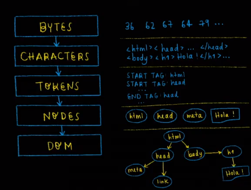
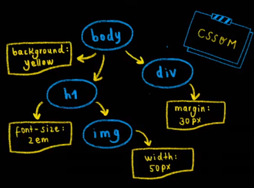
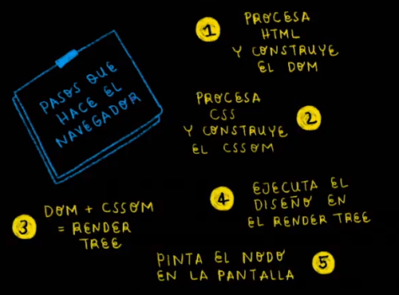
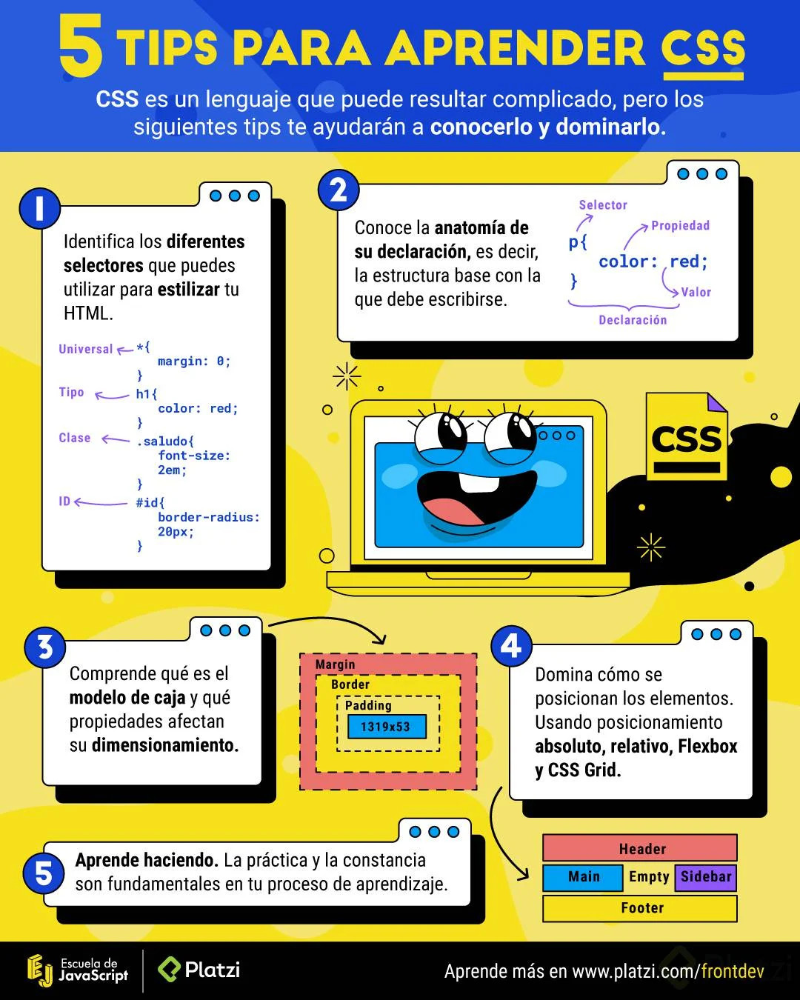
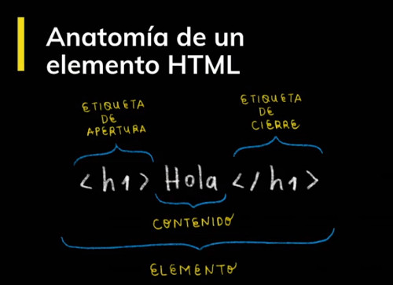
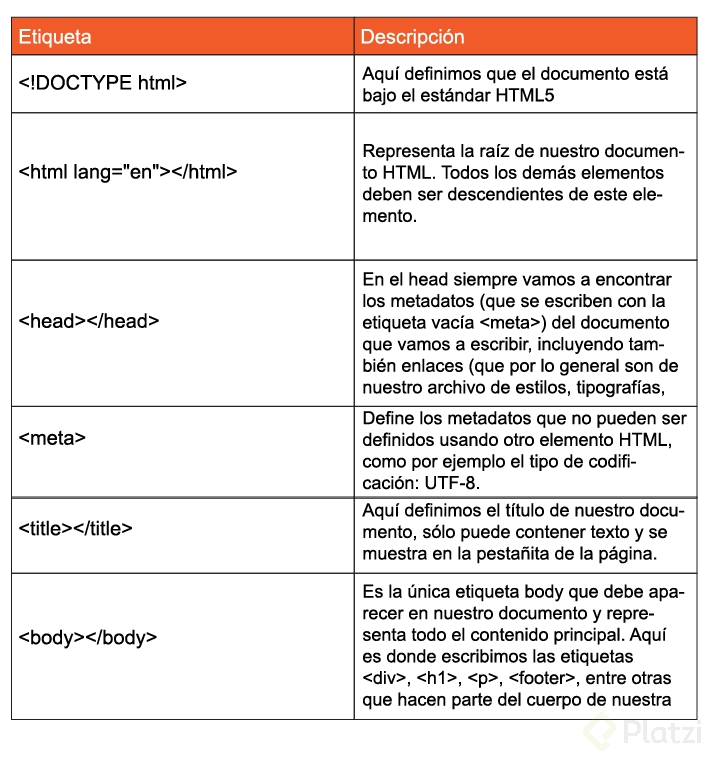
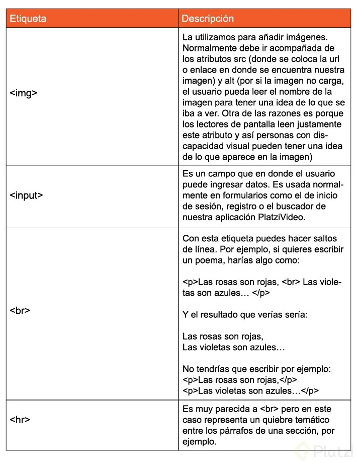
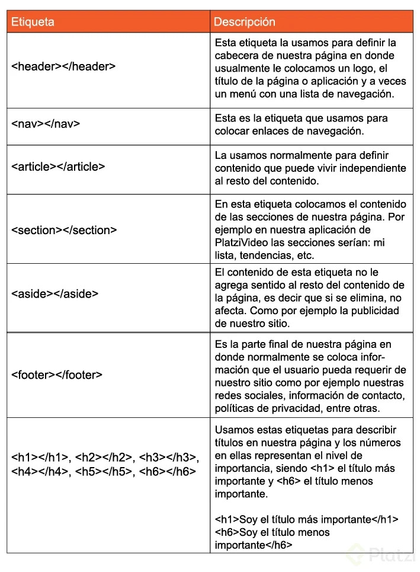
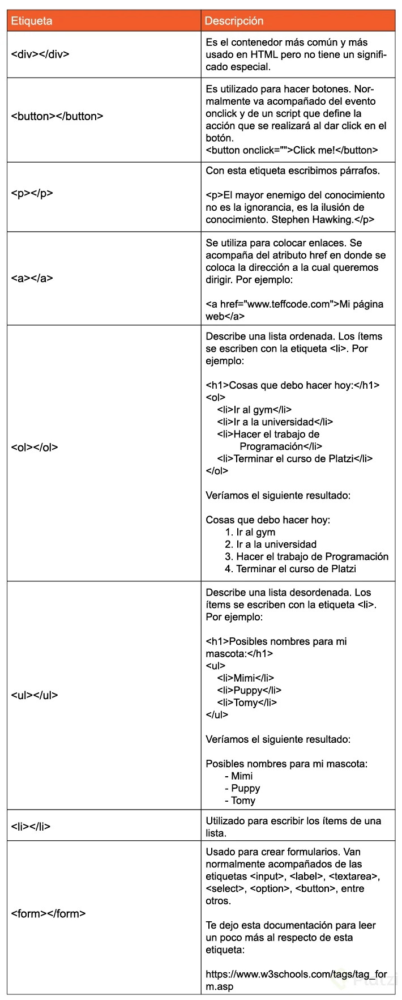
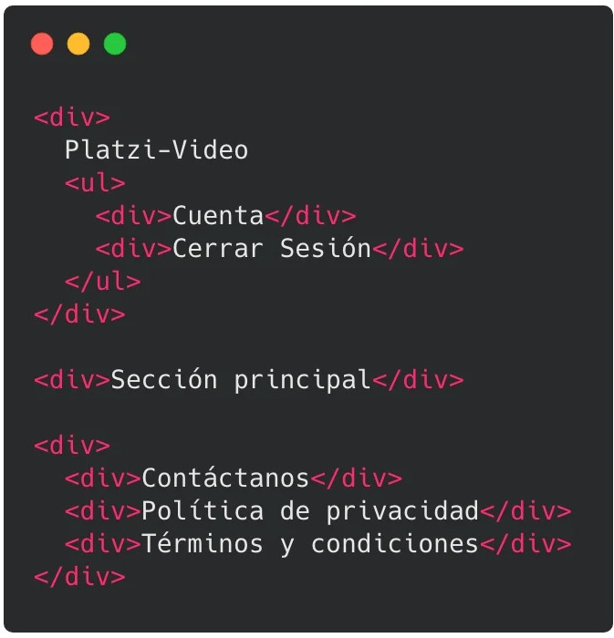

# Curso de Frontend Developer

## 01. Introducción

### Presentación y bienvenida al curso de Frontend Developer

### HTML y CSS: definición y usos

Internet: Interconnected y Network
Red de computadoras conectadas en todo el mundo.

Tim Berners-Lee Invento World Wide Web.
Fundo el consorcio W3C para estandarizar el desarrollo de las tecnologías base Internet

HTTP Hyper Text Transfer Protocol / (Permite la comunicación de datos entre dispositivos)
URL Uniform Resource Locator: (Dirección de un sitio web)
HTML Hyper Text Markup Language (Lenguaje para describir la estructura de una sitio web)
En 1994 apareció CSS Cascade Style Sheets.


### ¿Qué son y para qué nos sirven HTML y CSS?

**HTML**: Es un lenguaje de marcado usado para decirle a tu navegador cómo estructurar las páginas web que visitas. No es un lenguaje de programación.

**CSS**: Es un lenguaje que nos permite crear páginas web con un diseño agradable para los usuarios. Tampoco es un lenguaje de programación.

https://htmlreference.io/

https://cssreference.io/


### DOM, CSSOM, Render Tree y el proceso de renderizado de la Web

DOM: Document Object Model. Es una transformación del código HTML escrito por nosotros a objetos entendibles para el navegador.

CSSOM: así como el DOM para el HTML, EL CSSOM es una representación de objetos de nuestros estilos en CSS.

Render Tree: es la unión entre el DOM y el CSSOM para renderizar todo el código de nuestra página web.

Pasos que sigue el navegador para construir las páginas web:

1. Procesa el HTML para construir el DOM.
2. Procesa el CSS para construir el CSSOM.
3. El DOM se une con el CSSOM para crear el Render Tree.
4. Se aplican los estilos CSS en el Render Tree.
5. Se ““pintan”” los nodos en la pantalla para que los usuarios vean el contenido de la página web.








### 5 tips para aprender CSS




## 2.Conceptos iniciales de HTML

### Anatomía de un Elemento HTML: Atributos, Anidamiento y Elementos vacíos

Nuestros elementos HTML se componen de:

- **Etiqueta de apertura**: el nombre de nuestra etiqueta encerrado entre símbolos de mayor o menor. Por ejemplo: **`<h1>`**.
- **Contenido**: dentro de nuestras etiquetas podemos añadir texto u otros elementos HTML, lo que conocemos como **anidamiento**.
- **Etiqueta de cierre**: son casi iguales que las etiquetas de apertura, pero también necesitan un slash (**`/`**) antes del nombre de la etiqueta. Por ejemplo: **`</h1>`**.

Las etiquetas de apertura también pueden tener atributos. Los atributos nos permiten definir características especiales para nuestros elementos: **`<etiqueta atributo=""valor del atributo"">`**. Por ejemplo: **`<h1 class=""saludo"">`**.

También existen elementos vacíos. Estos elementos no tienen contenido ni etiqueta de cierre, solo etiqueta de apertura y atributos. Por ejemplo: **``**.




### Anatomía de un Documento HTML: DOCTYPE, html, head y body

Para identificar visualmente el orden en tu archivo HTML se indenta el código (se usan espacios).

Anatomia de HTML:

- Primero se declara que tipo de documento es usando <!DOCTYPE html>
- Segundo v la etiqueta <html></html> que define todo tu documento
- Tercero, dentro de tu etiqueta HTML van dos etiquetas: el <head></head> y el <body></body>
- Cuarto, dentro del <head> va el titulo (<title></title>), los meta (información sobre lenguaje, compatibilidad, etc.) y también puede ir los <style> y <link>
- Quinto, dentro del <body> va toda la estructura de nuestra página. Esto es lo que se mostrara en pantalla.


### Funciones de las etiquetas HTML más importantes

Al hacer en nuestro editor de código **html:5** vemos que nos aparece la siguiente estructura:

```html
<!DOCTYPE
<html lang="en">
<head>
  <meta charset="UTF-8">
  <meta name="viewport" content="width=device-width, initial-scale=1.0">
  <meta http-equiv="X-UA-Compatible" content="ie=edge">
  <title>Document</title>
</head>
<body>
  
</body>
</html>
```

Veamos la descripción de estos elementos:



Si por ejemplo queremos añadir en nuestro documento estilos o JavaScript, lo hacemos con las etiquetas <style> y <script> respectivamente, que a su vez deben ir dentro de la etiqueta raíz <html>, algo así:

```html
<!DOCTYPE
<html lang="en">
<head>
  <meta charset="UTF-8">
  <meta name="viewport" content="width=device-width, initial-scale=1.0">
  <meta http-equiv="X-UA-Compatible" content="ie=edge">
  <title>Document</title>
</head>
<style>
    /* Aquí iría nuestro CSS */
</style>
<script>
    // Aquí debería ir nuestro JavaScript
</script>
<body>
  
</body>
</html>
```

Descripción de algunos elementos vacíos:



Descripción de las etiquetas semánticas para la estructura base de nuestra página:



Descripción de otras etiquetas muy usadas:




### La importancia del código semántico

Es importante que como desarrolladores tengamos claro el significado de escribir código. Debes ser consciente de que la manera en la que codeas tenga sentido.

La semántica HTML no es más que darle sentido y estructura a lo que estas escribiendo. Muy importante para el navegador. No todos los elementos deberían ser un div.


### Tipos de errores en HTML, debugging y servicio de validación de etiquetas


**Errores sintácticos**: Son errores de escritura en el código y evitan que el programa funcione. Pueden ser errores de tipado.

**Errores lógicos**: En estos la sintaxis es correcta, pero el código no hace lo que debería. El programa funciona, pero de forma incorrecta.

https://validator.w3.org/


### Reto 1: Organiza el siguiente bloque de código de forma semántica

Hola !

Ya conocimos la importancia de hacer nuestro HTML de forma semántica. Así que, aquí tengo un reto para ti.

A continuación te mostraré un código HTML y la idea es que tu lo organices de forma semántica, es decir, que uses las etiquetas más adecuadas.



