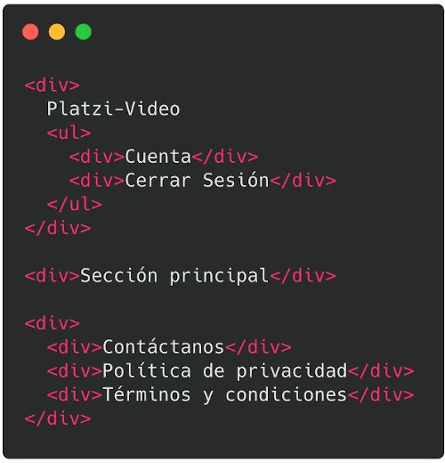
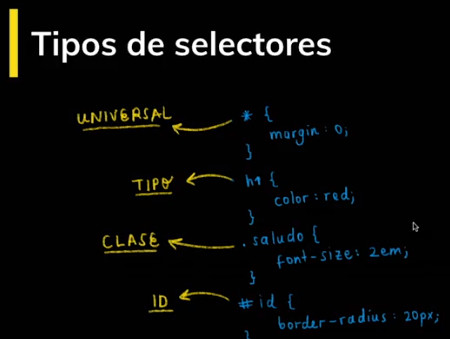
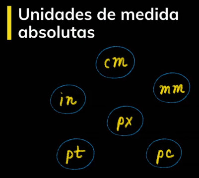
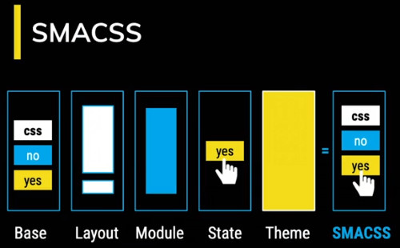

# Curso de Frontend Developer

## 01. Introducción

### Presentación y bienvenida al curso de Frontend Developer

### HTML y CSS: definición y usos

Internet: Interconnected y Network
Red de computadoras conectadas en todo el mundo.

Tim Berners-Lee Invento World Wide Web.
Fundo el consorcio W3C para estandarizar el desarrollo de las tecnologías base Internet

HTTP Hyper Text Transfer Protocol / (Permite la comunicación de datos entre dispositivos)
URL Uniform Resource Locator: (Dirección de un sitio web)
HTML Hyper Text Markup Language (Lenguaje para describir la estructura de una sitio web)
En 1994 apareció CSS Cascade Style Sheets.


### ¿Qué son y para qué nos sirven HTML y CSS?

**HTML**: Es un lenguaje de marcado usado para decirle a tu navegador cómo estructurar las páginas web que visitas. No es un lenguaje de programación.

**CSS**: Es un lenguaje que nos permite crear páginas web con un diseño agradable para los usuarios. Tampoco es un lenguaje de programación.

https://htmlreference.io/

https://cssreference.io/


### DOM, CSSOM, Render Tree y el proceso de renderizado de la Web

DOM: Document Object Model. Es una transformación del código HTML escrito por nosotros a objetos entendibles para el navegador.

CSSOM: así como el DOM para el HTML, EL CSSOM es una representación de objetos de nuestros estilos en CSS.

Render Tree: es la unión entre el DOM y el CSSOM para renderizar todo el código de nuestra página web.

Pasos que sigue el navegador para construir las páginas web:

1. Procesa el HTML para construir el DOM.
2. Procesa el CSS para construir el CSSOM.
3. El DOM se une con el CSSOM para crear el Render Tree.
4. Se aplican los estilos CSS en el Render Tree.
5. Se ““pintan”” los nodos en la pantalla para que los usuarios vean el contenido de la página web.


### 5 tips para aprender CSS


## 2.Conceptos iniciales de HTML

### Anatomía de un Elemento HTML: Atributos, Anidamiento y Elementos vacíos

Nuestros elementos HTML se componen de:

- **Etiqueta de apertura**: el nombre de nuestra etiqueta encerrado entre símbolos de mayor o menor. Por ejemplo: **`<h1>`**.
- **Contenido**: dentro de nuestras etiquetas podemos añadir texto u otros elementos HTML, lo que conocemos como **anidamiento**.
- **Etiqueta de cierre**: son casi iguales que las etiquetas de apertura, pero también necesitan un slash (**`/`**) antes del nombre de la etiqueta. Por ejemplo: **`</h1>`**.

Las etiquetas de apertura también pueden tener atributos. Los atributos nos permiten definir características especiales para nuestros elementos: **`<etiqueta atributo=""valor del atributo"">`**. Por ejemplo: **`<h1 class=""saludo"">`**.

También existen elementos vacíos. Estos elementos no tienen contenido ni etiqueta de cierre, solo etiqueta de apertura y atributos. Por ejemplo: **``**.


### Anatomía de un Documento HTML: DOCTYPE, html, head y body

Para identificar visualmente el orden en tu archivo HTML se indenta el código (se usan espacios).

Anatomia de HTML:

- Primero se declara que tipo de documento es usando <!DOCTYPE html>
- Segundo v la etiqueta <html></html> que define todo tu documento
- Tercero, dentro de tu etiqueta HTML van dos etiquetas: el <head></head> y el <body></body>
- Cuarto, dentro del <head> va el titulo (<title></title>), los meta (información sobre lenguaje, compatibilidad, etc.) y también puede ir los <style> y <link>
- Quinto, dentro del <body> va toda la estructura de nuestra página. Esto es lo que se mostrara en pantalla.


### Funciones de las etiquetas HTML más importantes

Al hacer en nuestro editor de código **html:5** vemos que nos aparece la siguiente estructura:

```html
<!DOCTYPE
<html lang="en">
<head>
  <meta charset="UTF-8">
  <meta name="viewport" content="width=device-width, initial-scale=1.0">
  <meta http-equiv="X-UA-Compatible" content="ie=edge">
  <title>Document</title>
</head>
<body>
  
</body>
</html>
```

Veamos la descripción de estos elementos:


Si por ejemplo queremos añadir en nuestro documento estilos o JavaScript, lo hacemos con las etiquetas <style> y <script> respectivamente, que a su vez deben ir dentro de la etiqueta raíz <html>, algo así:

```html
<!DOCTYPE
<html lang="en">
<head>
  <meta charset="UTF-8">
  <meta name="viewport" content="width=device-width, initial-scale=1.0">
  <meta http-equiv="X-UA-Compatible" content="ie=edge">
  <title>Document</title>
</head>
<style>
    /* Aquí iría nuestro CSS */
</style>
<script>
    // Aquí debería ir nuestro JavaScript
</script>
<body>
  
</body>
</html>
```

Descripción de algunos elementos vacíos:


Descripción de las etiquetas semánticas para la estructura base de nuestra página:


Descripción de otras etiquetas muy usadas:


### La importancia del código semántico

Es importante que como desarrolladores tengamos claro el significado de escribir código. Debes ser consciente de que la manera en la que codeas tenga sentido.

La semántica HTML no es más que darle sentido y estructura a lo que estas escribiendo. Muy importante para el navegador. No todos los elementos deberían ser un div.


### Tipos de errores en HTML, debugging y servicio de validación de etiquetas


**Errores sintácticos**: Son errores de escritura en el código y evitan que el programa funcione. Pueden ser errores de tipado.

**Errores lógicos**: En estos la sintaxis es correcta, pero el código no hace lo que debería. El programa funciona, pero de forma incorrecta.

https://validator.w3.org/


### Reto 1: Organiza el siguiente bloque de código de forma semántica

Hola !

Ya conocimos la importancia de hacer nuestro HTML de forma semántica. Así que, aquí tengo un reto para ti.

A continuación te mostraré un código HTML y la idea es que tu lo organices de forma semántica, es decir, que uses las etiquetas más adecuadas.




## 3.Conceptos iniciales de CSS

### Anatomía de una declaración CSS: Selectores, Propiedades y Valores

Nuestros estilos con CSS se componen de:

- **Selector:** son la referencia a los elementos HTML que queremos estilizar. Los nombres de estas etiquetas van seguidas de una llave de apertura y otra de cierre ({}). Por ejemplo: h1 {}.
- **Propiedades:** son el tipo de estilo que queremos darle a nuestros elementos. Van seguidas de dos puntos (:). Las propiedades deben estar dentro de las llaves del selector que definimos anteriormente. Podemos escribir diferentes propiedades en un mismo selector. Por ejemplo: h1 { color: }.
- **Valores:** son el estilo que queremos que tomen nuestros elementos HTML con respecto a una propiedad. Van seguidas de un punto y coma (;). Por ejemplo: h1 { color: red; }.

```css
h1 {
  color: red;
}
```


### Tipos de selectores, pseudo-clases y pseudo-elementos

***(asterisco)**: Es el selector universal. Las propiedades se aplicaran a todos los elementos de nuestro HTML.

**Tipo**: Son selectores que se aplican a cierto elemento HTML en específico. Las propiedades se aplicaran a la etiqueta que queremos, por ejemplo `p`, `body`, `html`, `div`, etc.

**Clase**: Si nuestras etiqueta de HTML tienen un atributo de `class` podemos usar ese valor o identificador para que los cambios en el CSS afecten únicamente a ese elemento.

**ID**: Es similar al anterior, si la etiqueta HTML tiene un ID podemos afectar solo ese elemento.

Las **Pseudo-clases** y **Pseudo-elementos** nos permiten ser aún más específicos con qué elemento o partes de nuestros elementos deben recibir los estilos.

Para usarlas debemos definir el selector base (por ejemplo, **`p`**) seguido de dos puntos y la pseudo-clase que queremos estilizar (por ejemplo: **`p:first-child`**). En el caso de los pseudo-elementos debemos usar el dos puntos 2 veces (**`p::first-letter`**).

```css
/* Asterisco (universal) */
* {
  margin: 0;
}

/* Tipo */
h1 {
  color: red;
}

/* Clase */
.saludo {
  font-size: 2em;
}

/* ID */
#id {
  border-radius: 20px;
}

/* Pseudo-clases */
p:first-child {
  color: white;
}

p:last-child {
  color: purple;
}

p:nth-child(2n) {
  color: red;
}
```



https://developer.mozilla.org/en-US/docs/Web/CSS/Pseudo-classes

https://developer.mozilla.org/en-US/docs/Web/CSS/Pseudo-elements

https://coolsymbol.com/emojis/emoji-for-copy-and-paste.html


### Modelo de caja

Todos los elementos de HTML tienen un modelo de caja y esta compuesto por cuatro elementos: contenido, padding, border, margin.

https://picular.co/Video

https://paletton.com/#uid=1000u0kllllaFw0g0qFqFg0w0aF

https://coolors.co/001514-fbfffe-6b0504-a3320b-e6af2e

https://colorhunt.co/


### Valores relativos y absolutos

Los valores absolutos son, por ejemplo, centímetros, milímetros, pixeles y pulgadas. Se llaman de esta forma porque no tienen en cuenta a nadie más, no depende de la medida de otra unidad.

Los valores relativas, llevan este nombre porque depende de otra unidad de medida o elemento. Por ejemplo, porcentajes, vmx, em, entre otros.

Recuerda que podemos darle estilos a etiquetas HTML muy específicas indicando dónde se van a encontrar. Por ejemplo: si queremos darle estilos únicamente a la imagen que está dentro del header, podemos usar el selector css header img { ... }.

No olvides resolver el desafío: crear tu propio header con las etiquetas y estilos que más te gusten para compartirlo en la sección de discusiones.




### Displays en CSS

Todos los elementos en CSS son cuadrados o rectángulos y aparte de eso, estos elementos tienen un comportamiento que se define a través de la propiedad display. Los display más comunes y usados son: block, inline, inline-block, none, table, flex y grid. Veamos de qué se tratan:


### Funciones de las propiedades CSS más usadas

**width**: Define el ancho de un elemento. Por ejemplo: width: 20px;.

**height**: Define el alto de un elemento. Por ejemplo: height: 20px;.

**background**: Puede definir el color de fondo o la url de fondo de un elemento. Por ejemplo: background: url(';puppy.png';);.

**background-color**: Define el color de fondo de un elemento. Por ejemplo: background-color: red;.

**color**: Define el color de nuestros textos. Estos colores los podemos escribir de 3 formas en CSS:

- Con los nombres de los colores. Por ejemplo: black, red, green.
- Sistema hexadecimal: Donde blanco se define como #FFFFFF y negro como #000000. Una página que me gusta mucho para sacar colores en hexadecimal es colorhunt.co.
- RGB: Donde la R significa Red, G significa Green y B significa Blue; por lo que escribimos rgb(red, green, blue) y cada uno de ellos es un valor de 0 a 255 que describe la intensidad de ese color. Por ejemplo, para denotar el color verde, escribimos: rgb(0, 255, 0). También a estos valores se les puede agregar una opacidad (transparencia) que va de 0 a 1, por ejemplo: rgba(0, 255, 0, 0.5) lo que quiere decir que el color verde lo queremos con una transparencia del 50%.
  border: Define el tamaño, estilo y color del borde de un elemento. Por ejemplo: border: 2px solid yellow;.

**border-radius**: Define qué tan redondeado quiero mi elemento. Por ejemplo: border-radius: 20px;.

**margin**: Define la margen de un elemento. Por ejemplo: margin: 2px (lo que quiere decir que mi elemento tendrá márgenes en todos sus lados de 2px).

Si quiero que mi elemento tenga margen superior de 2px, margen inferior de 4px, margen derecha de 3px y margen izquierda de 5px, lo escribiría de la siguiente forma: margin: 2px 3px 4px 5px. El primer valor es la margen superior y siempre va en sentido de las manecillas del reloj.

Si solo quiero que mi elemento tenga una margen a la derecha de 10px, escribiría margin-right: 10px;. Y para los demás valores sería margin-top: 10px; para la margen superior, margin-bottom: 10px; para la margen inferior y margin-left: 10px; para la margen izquierda.

**padding**: Define la distancia del borde de un elemento hasta su contenido. Por ejemplo: padding: 2px (lo que quiere decir que mi elemento tendrá un “margen interno” en todos sus lados de 2px).

Si quiero que mi elemento tenga padding superior de 2px, padding inferior de 4px, padding a la derecha de 3px y un padding a la izquierda de 5px, lo escribiría de la siguiente forma: padding: 2px 3px 4px 5px. El primer valor es la padding superior y siempre va en sentido de las manecillas del reloj al igual que con las márgenes.

Si solo quiero que mi elemento tenga un padding a la derecha de 10px, escribiría: padding-right: 10px;. Y para los demás valores sería padding-top: 10px; para la margen superior, padding-bottom: 10px; para la margen inferior y padding-left: 10px; para la margen izquierda.

**font-size**: Define el tamaño de la fuente. Por ejemplo: font-size: 20px;.

**font-family**: Define la familia tipográfica de la fuente. Por ejemplo: font-family: 'Roboto', sans-serif;.

Una página de fuentes que me gusta mucho es fonts.google.com.

**opacity**: Determina la transparencia del elemento. Tiene valores entre 0 y 1, que pueden verse como un porcentaje. Por ejemplo, si quiero que mi elemento se vea con una transparencia del 50%, escribiría: opacity: 0.5;.

**outline**: Un término algo desconocido es el esquema de los elementos HTML. Un esquema es una línea (por defecto, de color azúl) que se dibuja alrededor de los elementos que hace que “se destaquen”.

Lo anterior sucede mucho en elementos como los <input>s y los <button>s. Si no queremos ver esa línea, lo que hacemos es outline: none;. Aunque también podemos decirle que tenga determinado estilo, color, tamaño, entre otras. Por ejemplo:

```css
outline-style: solid;
outline-color: red;
outline-width: 5px;
```

**box-sizing**: Cuando trabajamos con paddings, por ejemplo, veremos que el tamaño de nuestro elemento crece. Es decir, si tengo:

```html
div {
   background: pink;
   width: 20px;
   height: 20px;
}
```

Y luego le agrego un padding de 20px, veré en el navegador que mi div ya no tiene un ancho y un alto de 20px, sino de 40px cada uno. Lo que quiere decir que el padding hizo que creciera mi elemento. Sin embargo, si yo no quiero que el padding afecte los 20px originales, le agrego la propiedad box-sizing para que el tamaño total del elemento incluya el padding también y no se vea afectado por él.

**transition**: Las transiciones CSS le permiten cambiar los valores de las propiedades sin problemas durante una duración determinada. Debemos tener presente que una transición NO es una animación. Una transición va de un punto A a un punto B sin interrupciones o saltos en medio.

Te comparto la siguiente documentación para que puedas visualizar las propiedades y valores que puedes utilizar:

https://www.w3schools.com/css/css3_transitions.asp.
https://developer.mozilla.org/en-US/docs/Web/CSS/CSS_Transitions/Using_CSS_transitions
https://css-tricks.com/almanac/properties/t/transition/
animation: Esta propiedad permite que animemos nuestros elementos.

Te comparto la siguiente documentación para que puedas visualizar las propiedades y valores que puedes utilizar:

https://www.w3schools.com/css/css3_animations.asp
https://developer.mozilla.org/en-US/docs/Web/CSS/CSS_Animations/Using_CSS_animations
https://css-tricks.com/almanac/properties/a/animation/

### Posicionamiento en CSS

El posicionamiento en CSS es una de las cosas más importantes, pues establece cómo van a estar ubicados nuestros elementos en la pantalla.

En CSS los elementos se posicionan utilizando las propiedades top (superior), bottom (inferior), left (izquierda) y right (derecha), pero sólo funcionarán si la propiedad position está establecida. Esto quiere decir que si quiero que mi elemento div esté completamente a la derecha, debo escribir en mi CSS lo siguiente:

```css
div { position: absolute: right: 0px; }
```
La propiedad position tiene 7 valores diferentes: relative, absolute, fixed, sticky, static, initial e inherit. Veremos de qué se tratan:


## 4.Arquitectura CSS

### ¿Qué son y para qué nos sirven las arquitecturas CSS?

Un resumen de la clase.

**Los objetivos son**:

- Predecible > Escribir reglas claras.
- Reutilizable > No escribir codigo redundante.
- Mantenible > Que sea facil de leer y adaptarnos a los estandares.
- Escalable > Que pueda crecer facilmente pero sin afectar el rendimiento.


**Buenas practicas**

- Establecer reglas para que el equipo se entienda.
- Explicar la estructura base o dar los fundamentos del proyecto a un nuevo integrante.
- Evitar hojas de estilo muy extensas
- Tener una buena documentación explicando ciertos aspectos del codigo.


### OOCSS, BEM, SMACSS, ITCSS y Atomic Design

**OOCSS**
css orientado a objetos. Separa el diseño del contenido, así podemos reutilizar nuestro código

```css
// ejemplo, en vez de para cada elemento una clase.
.globalWidth {
	width: 100%;
}
```


**BEM**
Block Element Modifier. Separa los elementos y los modificadores

```css
.header {}  // bloque
.header__button--red {} // block, element, modifier
```


**SMACSS (Scalable and Modular Arquitecture for CSS)**
Arquitectura de css escalable y modular.`
Para eso se realizan cinco pasos

1. Dividir nuestro css en componentes base
2. Definir Layout. Elementos que se utilizan solo una vez. ej. Footer, Header
3. Definir Módulos. Componentes que se usan más de una vez
4. Definir Estados. Estos estados definen los cambios que existen en nuestros elementos/componentes. ej. Cambio de color cuando hacen hover
5. Definir Temas. Separar los temas y sus cambios. Si tuvieras tema



**ITCSS Invertid Triangle CSS**
Con esta metodología podemos dividir todos nuestros archivos de css en ciertas partes para que no se mezclen.` *(Triangulo invertido, desde arriba hacia abajo):*


**Atomic Design (Basados en la química).**
`Átomos < Moléculas < Organismos < Templates < Paginas`


### Reto 2: Identifica el error de arquitectura del siguiente bloque de código

Una de las metodologías que podemos utilizar para organizar nuestro código es BEM (Bloque, Elemento, Modificador).

A continuación, te mostraré 3 bloques de código. Identifica cuál bloque de código es el indicado para usar esta metodología.


## 5. Construcción de componentes
### ¿Qué es un componente? Analicemos nuestros diseños

En esta clase la profesora Estefany Aguilar nos explica qué es un componente en el mundo del frontend. También analizaremos el diseño del proyecto del curso.

Un componente, tanto en diseño como desarrollo web, es un elemento muy pequeño que tiene la capacidad de ser reutilizado en diferentes partes de una aplicación. Por ejemplo: botones, iconos, cards, entre otras. Puedes apreciarlos en las plataformas que visitas todos los días: Twitter, Facebook, Platzi, YouTube y muchas más.


### Estructura con HTML y BEM de un menú desplegable


https://iconos8.es/


### Estilizando nuestro menú desplegable con CSS

https://css-tricks.com/snippets/css/a-guide-to-flexbox/

https://fonts.google.com/


### Creación de un buscador

